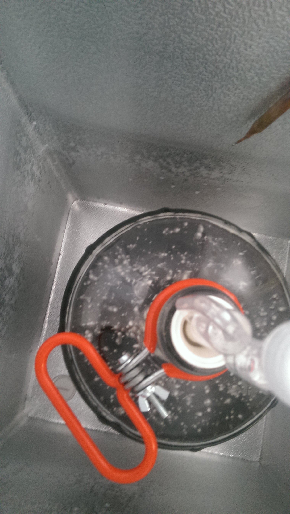

#Rauchbier (extract, 3 gallons)
##Ingredients
* 1 lb Smoked Beech Grains
* 4.8 Oz Munic 20
* 4.8 Oz Cara Munich III
* 2 lb Munic LME
* 2 lb Pilsner LME
* 1.2 oz Perle Hops (60 min)
* 0.3 oz Crystal Hops (15 min)
* Lager yeast (WLP838)
* 1.25 cups DME for bottling

##Instructions
1. Steep grains in 1.5 gallons of water at 155 degrees Fahrenhiet for 10-15 minutes
2. Remove grains, bring water to a boil
3. Add LME and Perle hops, bring to a boil, boil for 45 minutes
4. Add Crystal hops, boil for 15 minutes
5. Cool wort to room temperature, add yeast
6. Once fermentation begins, lager at 42-58 degrees Fahrenheit for six weeks.

##Notes
Bought a chest freezer and temperature controller for lagering.
Will be the first batch with campden tablets

Brewed on 2015-03-01. Used campden tablets and irish moss. Pitched at 70 degrees and put into freezer with temp controller set to 50 degrees F.

Checked progress on 2015-03-06. Gravity was 1.020. Noticed some clumps of something on the furface:

Was concerned that this was an acetobacter infection. However, on examination on 2015-03-07, looks to be bubbles from yeast activity, and less like an infection.

Sampled gravity on 2015-03-23. Came out to about 1.029, which makes my previous reading suspect. In either case, fermentation is continuing along. Taste was solid, if a little weak. Will check the gravity after my trip to Colorado to see if it's ready for a rest.

Observed much slowed fermentation 2015-03-30. Performing a diacetyl rest by setting the temp controller to 65 degrees. Will possibly lager for a couple of weeks after the rest is complete.

Rest ended 2015-04-06. Gradually dropped temp to 40 degrees for lagering.
